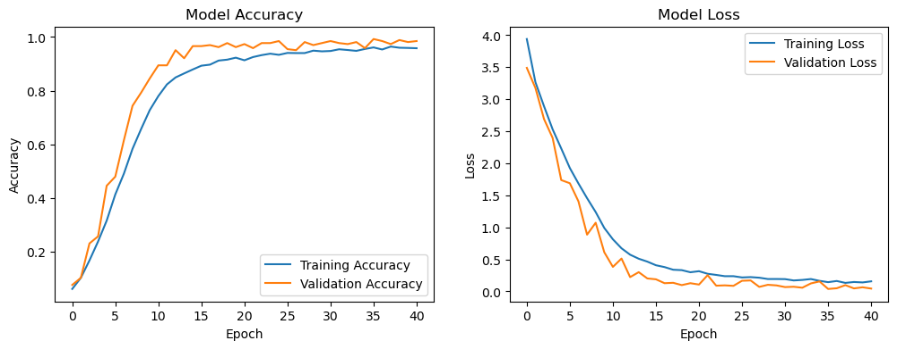
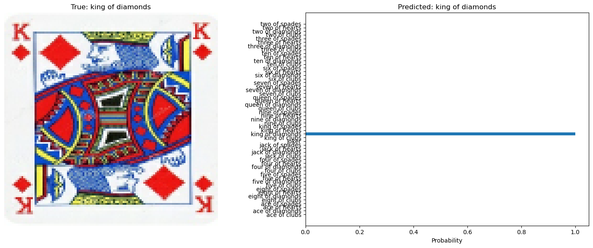
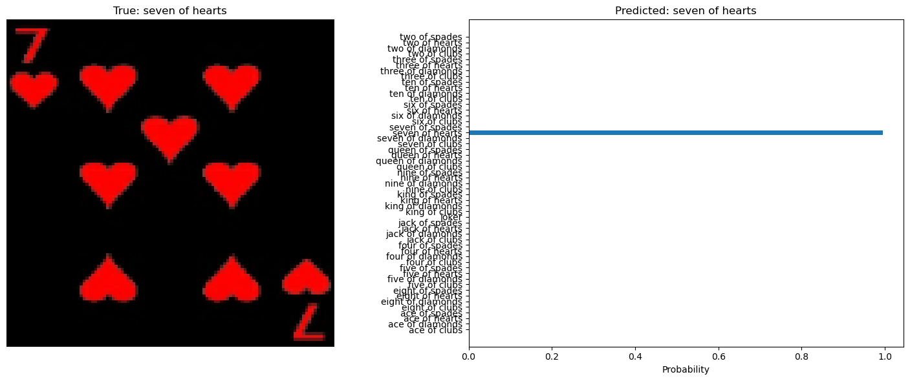
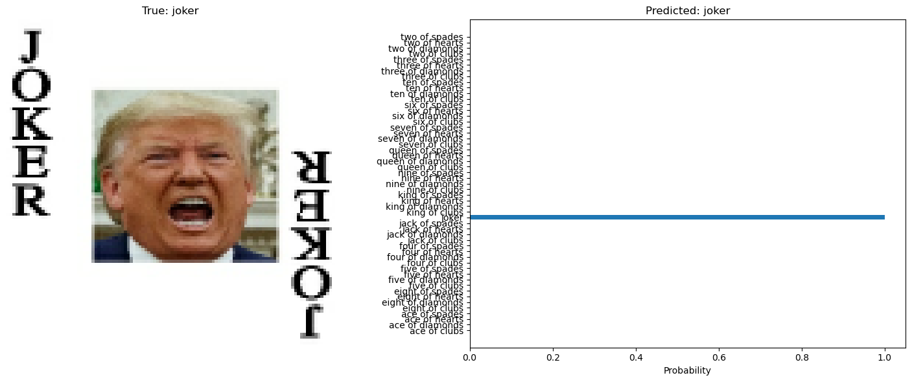
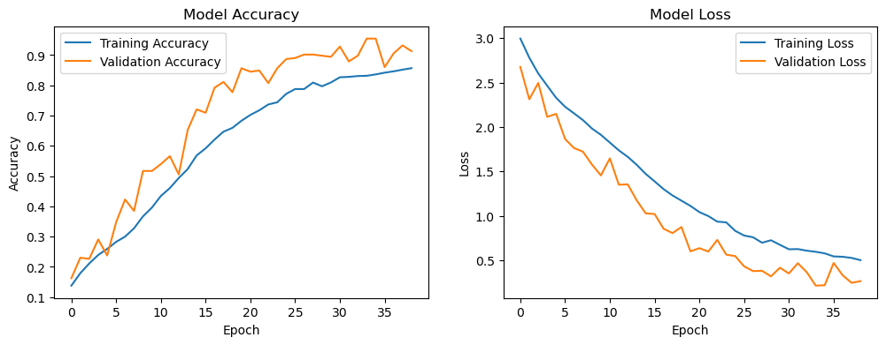
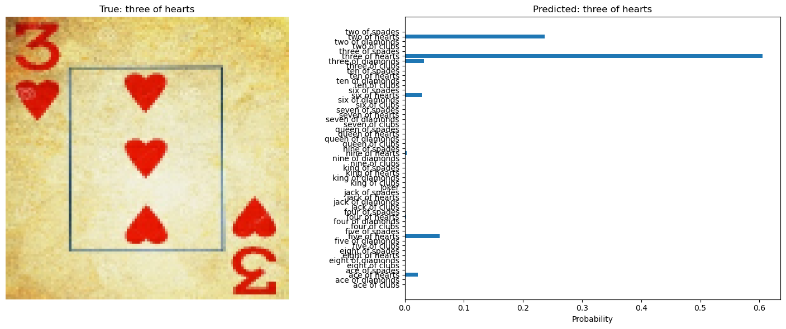
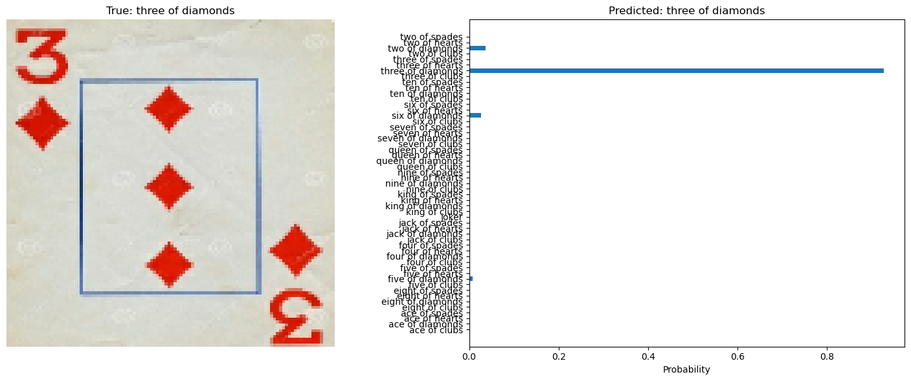

## 🃏 Card Image Classification Project
This repository contains the starter notebook for a deep learning project aimed at classifying images of various types of cards (e.g., playing cards, trading cards, etc.) using a Convolutional Neural Network (CNN) built with TensorFlow and Keras.

---

## ✨ Features
* Deep Learning Framework: Utilizes TensorFlow for efficient model building and training.

* Image Classification: Designed to classify card images across 53 distinct classes.

* Dataset Handling: Efficiently loads training, testing, and validation data using the image_dataset_from_directory utility.

* GPU Accelerated: Configured and checked for GPU utilization (CUDA/cuDNN) to speed up training.

* Data Visualization: Includes code for visualizing sample images from the dataset.
  
---

## 🚀 Getting Started
These instructions will get you a copy of the project up and running on your local machine for development and testing purposes.

Prerequisites
The core project is built using Python and the TensorFlow ecosystem. You'll need the following libraries:

* *Python 3.x*

* *TensorFlow* (The starter notebook uses 2.10.0)

* *NumPy*

* *Matplotlib*

* *CUDA/cuDNN* (Recommended for GPU support, as demonstrated in the notebook)

You can install the primary dependencies using pip:

```
Bash

pip install tensorflow numpy matplotlib
```

## Data Structure

The notebook expects the image data to be located in a main directory named CardDataset with the following structure:

```
.
└── CardDataset/
    ├── train/      (7624 files, 53 classes)
    │   ├── class_A/
    │   └── class_B/
    ├── test/       (265 files, 53 classes)
    │   ├── class_A/
    │   └── class_B/
    └── valid/      (265 files, 53 classes)
        ├── class_A/
        └── class_B/
```
The notebook sets the path to the data using the variable: `path_to_cards = "CardDataset"`.

## 🛠 Installation & Usage
1. Clone the repository:

```
Bash

git clone [YOUR_REPO_URL]
cd [YOUR_REPO_NAME]
```

2. Download the Dataset:
Note: The actual `CardDataset` is not included (FIle too large). You will need to obtain and place it in the project root directory following the structure above.

3. Run the Starter Notebook:
The project uses a Jupyter Notebook for the initial setup and data loading.

```
Bash

jupyter notebook starter.ipynb
```

## Key Setup Code
The `starter.ipynb` notebook initializes key parameters and loads the datasets:

Initialization and GPU Check:

```Python

import tensorflow as tf

# Path to the dataset
path_to_cards = "CardDataset"

# Check GPU availability and versions
print("TensorFlow version:", tf.__version__) # Output: TensorFlow version: 2.10.0
print("GPU available:", tf.config.list_physical_devices('GPU'))
print("Is TensorFlow using GPU?", tf.test.is_built_with_cuda())
```

## Data Loading Parameters:

The notebook defines the image size and batch size, and then loads the datasets:

```Python

SIZE = 224
BATCH_SIZE = 32

train_ds = tf.keras.preprocessing.image_dataset_from_directory(
    path_to_cards + "/train",
    labels="inferred",
    label_mode="categorical",
    batch_size=BATCH_SIZE,
    image_size=(SIZE, SIZE),
)

# ... similar code for test_ds and valid_ds
```

## Model performance

### Model Performance Comparison

| Model                  | Total Parameters | Trainable Parameters | Test Accuracy | Training Strategy                                    | Key Features                                                                 |
|-------------------------|-----------------|----------------------|---------------|------------------------------------------------------|-------------------------------------------------------------------------------|
| Best Performance Model  | 3,491,765       | 3,487,285            | 96.60%        | 50 epochs max, Early Stopping (patience=5), ReduceLROnPlateau | Residual blocks (64→128→256), BatchNorm, Dropout (0.5), Global Average Pooling |
| Size Optimized Model    | 68,464          | 67,120               | 90.57%        | 100 epochs max, Early Stopping, ReduceLROnPlateau    | SeparableConv2D, Reduced filters (32→64→128), Dropout (0.4), Efficient residual blocks |

## Default model

Training and validation accuracy and loss:


Default model prediction, (King of diamonds):


Default model prediction, (7 of hearts):


Default model prediction, (Trump joker):


## Size optimized model

Training and validation accuracy and loss:


Size optimized model prediction, (3 of hearts):


Size optimized model prediction, (3 of diamonds):


Size optimized model prediction, (5 of hearts):


## Architecture Details:
### Best Performance Model
* Input: 112×112×3 images with 0-1 normalization

* Architecture: Deep residual network with three stages

* Filter Progression: 64 → 128 → 256

* Regularization: Batch normalization + Dropout (0.5)

* Computational Cost: Higher (~3.5M parameters)

### Size Optimized Model
* Input: 112×112×3 images with 0-1 normalization

* Architecture: Efficient separable convolution network

* Filter Progression: 32 → 64 → 128

* Regularization: Batch normalization + Dropout (0.4)

* Computational Cost: 51× fewer parameters than best model

## Key Findings:
* Accuracy Trade-off: Size optimized model achieves 90.57% accuracy with 98% fewer parameters

* Training Efficiency: Both models used sophisticated training strategies with early stopping and learning rate scheduling

* Data Preprocessing: Downsampled to 112×112 provided optimal balance of detail preservation and computational efficiency

* Data Augmentation: Used horizontal flipping, saturation adjustment, contrast variation, and zoom variation

Performance Summary:
The best performance model demonstrates excellent accuracy (96.60%) suitable for high-precision applications, while the size optimized model provides a compelling efficiency-accuracy trade-off, achieving 90.57% accuracy with only 68K parameters - making it ideal for resource-constrained environments.
